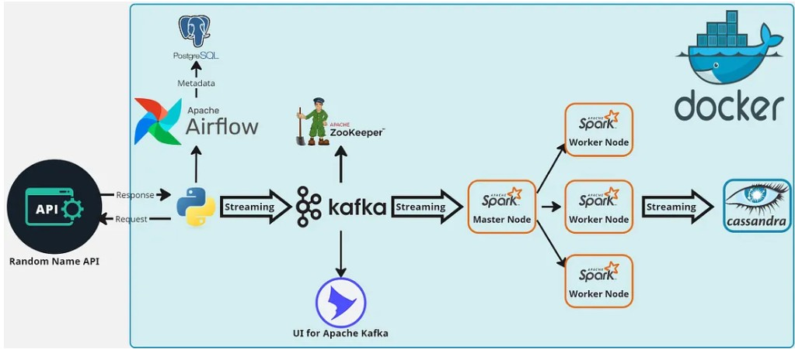
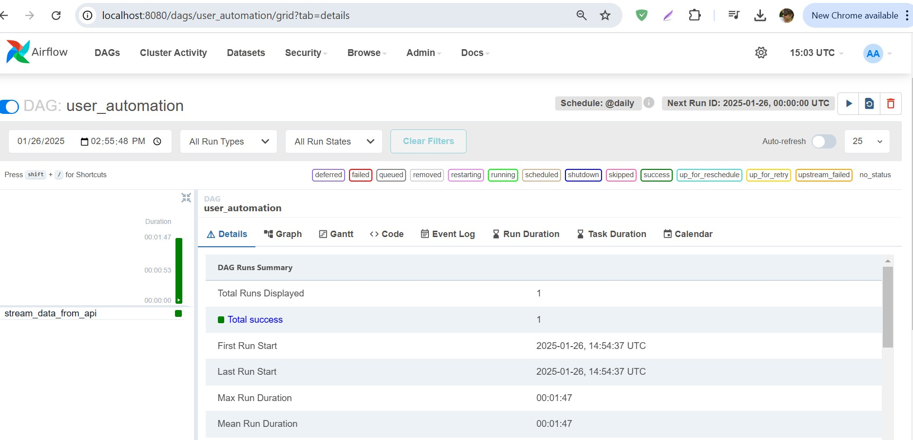
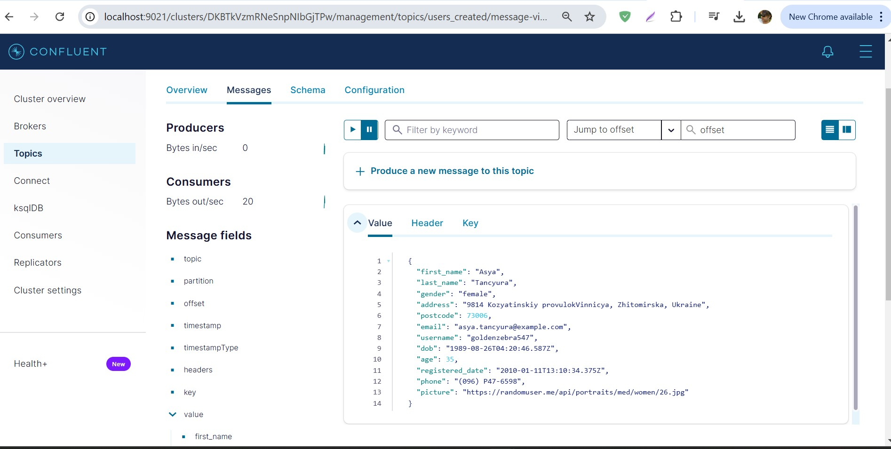
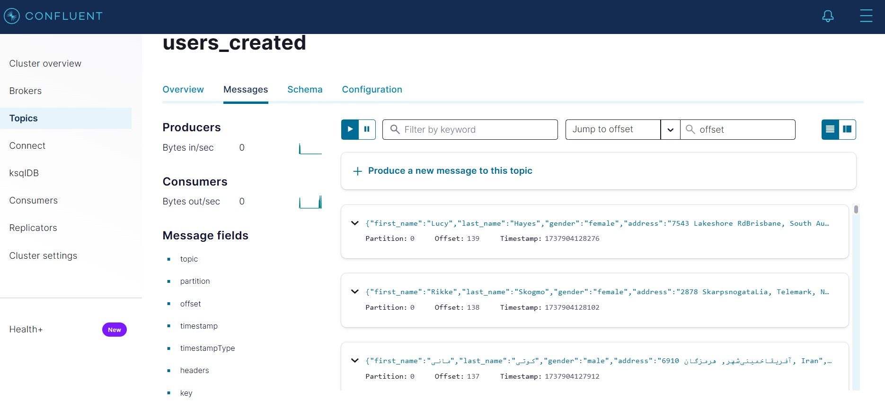

# Realtime_Data_Streaming__Data Engineering_Project
 An end-to-end data engineering pipeline that orchestrates data ingestion, processing, and storage using Apache Airflow, Python, Apache Kafka, Apache Zookeeper, Apache Spark, and Cassandra. This pipeline retrieves random user data from an API, processes it in real-time, and stores it for further analysis. All components are containerized with Docker for easy deployment and scalability.

 ## <ins>Project Overview</ins>

The Project implements a data pipeline that performs the following tasks:

 1. <b>Data Retrieval:</b> Fetch random user data from an API.
 2. <b>Data Streaming:</b> Stream this data to Kafka topics.
 3. <b>Real-Time Processing:</b> Process the data using Spark Structured Streaming.
 4. <b>Data Storage:</b> Store the processed data in Cassandra.

 ## <ins>System Architecture</ins>
  <p></p>

  The system consists of several key components:
    
 - <b>Data Source:</b> Real-time ingestion of data from [Random User API](https://randomuser.me/).
 - <b>Apache Airflow:</b> Responsible for orchestrating the pipeline and storing fetched data in a PostgreSQL database.
 - <b>Apache Kafka and Zookeeper:</b> Used for streaming data from PostgreSQL to the processing engine.
 - <b>Control Center and Schema Registry:</b> Helps in monitoring and schema management of our Kafka streams.
 - <b>Apache Spark:</b> For data processing with its master and worker nodes.
 - <b>Cassandra:</b> Where the processed data will be stored.

## <ins>Technologies</ins>
- Apache Airflow
- Python
- Apache Kafka
- Apache Zookeeper
- Apache Spark
- Cassandra
- PostgreSQL
- Docker

## Project Structure
### 1. **Airflow DAGs**
- `kafka_stream.py`: Automates the process of streaming data from the API to Kafka.
- Fetches data from Random User API.
- Streams data to Kafka topic `users_created`.

### 2. **Spark Streaming**
- `spark_stream.py`: Processes data from the Kafka topic, performs transformations, and saves it into Cassandra.
- Creates a Cassandra keyspace and table if not already existing.
- Processes the streamed data using Spark.
- Writes transformed data into Cassandra.

### 3. **Containerization**
- `docker-compose.yml`: Defines services including Kafka, Zookeeper, Airflow, Spark, Cassandra, and others.
- `entrypoint.sh`: Initializes the Airflow database and creates an admin user.

## Prerequisites
- Docker and Docker Compose
- Python 3.9 or later
- Java (for Kafka and Spark)
- Apache Airflow, Spark, Kafka, and Cassandra images are pulled via Docker Compose.

## <ins>Setup and Deployment</ins>
1. <b>Clone the Repository</b>:   
```sh
git clone <repository_url>
cd <repository_folder>
```

2. <b>Run Docker Compose</b>:
```sh
docker-compose up -d
```
3. <b>Set up Airflow</b>:
- The Airflow webserver is available at http://localhost:8080.
- Use the default credentials (username: admin, password: admin).
  <p></p>

4. <b>Check Apache Kafka</b>:
- User data is streaming
  <p></p>
  <p></p>

5. <b>Run the Spark Streaming Application</b>:
- Execute spark_stream.py using:
```sh
python spark_stream.py
```
 ## <ins>Data Flow</ins>

 1. <b>Airflow DAG</b> triggers the <b>kafka_stream.py</b> script.
 2. The script fetches user data from the API and publishes it to the Kafka topic.
 3. <b>Spark</b> reads data from Kafka, processes it, and writes it to <b>Cassandra</b>.
 4. Data is stored in the <b>spark_streams.created_users</b> table for querying and analysis.

 ## <ins>Testing the Pipeline</ins>

 1. <b>Validate Kafka Messages:</b> Use Kafka CLI tools to verify messages in the topic users_created.
 2. <b>Cassandra Query</b> Connect to Cassandra and check the data:
 ```sh
docker exec -it cassandra cqlsh -u cassandra -p cassandra localhost 9042
SELECT * FROM spark_streams.created_users;
```
 3. <b>Airflow Monitoring:</b> Verify DAG execution in the Airflow web interface.
